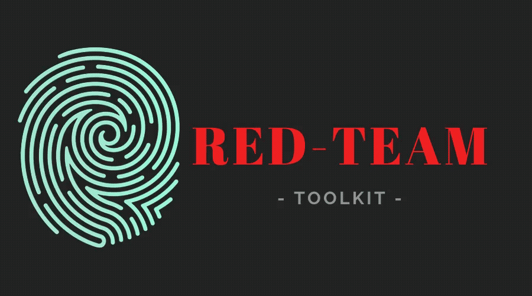
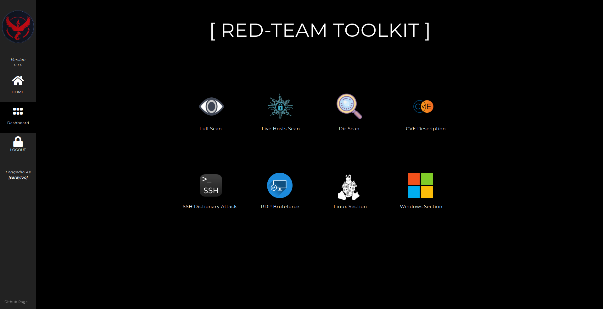
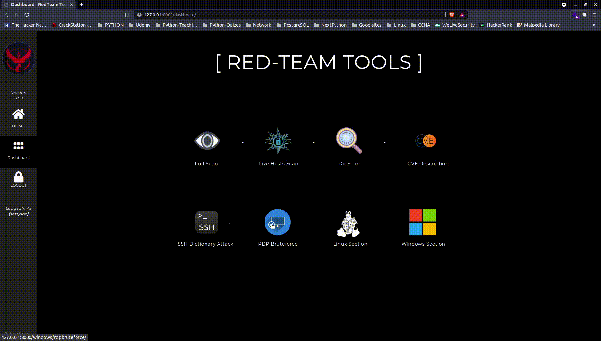
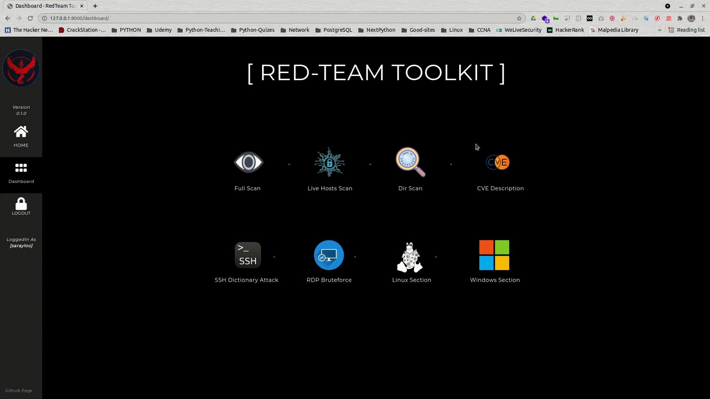

# RedTeam Toolkit

RedTeam Toolkit is an Open-Source project which tries to keep the useful offensive tools used in the red-teamming together in the simplest way to make the desired results to the security specialist to identify vulnerabilities.

This project has tried to use open-source projects such as nmap, rustscan, dirsearch, shreder, circl, crowbar, etc which will be a powerful toolkit together.

\
**Currently it supports the following options:**
- FullScan (scan ports and vulnerabilities/CVEs on the target - PDF output)
- Livehosts (scan all live hosts in the network scale - PDF output)
- DirScan (scan all directories on a target - PDF output)
- CVE Description (search a CVE-ID and get information, vendors will be added soon) - UNDER MAINTENANCE
- SSH Dictionary Attack
- RDP BruteForce
- Linux Section to exploit major Linux CVEs (UNDER MAINTENANCE)
- Windows Section to exploit major windows CVEs (UNDER MAINTENANCE)\
\


## Installation Guide
Currently only tested on Debian/Ubuntu. If you have tested in any other distribution and all the tools run smoothly, to add the distribution to this guide, please refer to the contributing section.
### Ubuntu/Debian
- #### Install Required packages:
```bash
$ sudo apt update && sudo apt install python3-pip python3-venv python3-django postgresql postgresql-contrib nmap git openvpn freerdp2-x11 tigervnc-viewer 
$ wget https://github.com/RustScan/RustScan/releases/download/2.0.1/rustscan_2.0.1_amd64.deb && sudo apt install ./rustscan_2.0.1_amd64.deb
$ git clone https://github.com/signorrayan/RedTeam_toolkit.git $$ cd RedTeam_toolkit
```
- #### Set-up Postgresql DB for django:
(set-up your password or you can set-up your new user & role):
```bash
sudo passwd postgres
```
login and create a new user and the database:
```postgresql
$ sudo -u postgres psql

postgres=# CREATE DATABASE redteam_toolkit_db;
postgres=# CREATE ROLE redteamuser with SUPERUSER CREATEDB LOGIN ENCRYPTED PASSWORD '147r258r'; -- we use this password in django settings.py
postgres=# GRANT ALL PRIVILEGES ON DATABASE redteam_toolkit_db TO redteamuser;
postgres=# ALTER DATABASE redteam_toolkit_db OWNER TO redteamuser;
postgres=# \q
```

- put your ``` SECRET_KEY ``` in a new file ``` RedTeam-toolkit/.env.py ``` (you can generate that in online sources, search Django Secret Key Generator)
```python
# RedTeam-toolkit/.env.py
SECRET_KEY = 'Your Secret Key'
```

- #### active venv and Install the python packages:

```
$ python3 -m venv venv
$ source venv/bin/activate
$ pip3 install -r requirements.txt
```

- #### Database migration:
```
python manage.py makemigrations
python manage.py migrate
```

- #### Create a superuser to manage admin page :
you will need this user to login in the Web-UI
```
python manage.py createsuperuser
```
- #### Start the project :
```
python manage.py runserver
```

- #### You can access that via:
``` 127.0.0.1:8000 ```

and you can login with your superuser or create a new user through:
``` http://127.0.0.1:8000/sherlockholmes ``` admin page.\
Enter your superuser information and in the management page, you can add a new user.

login and start using that.\
if you have any question about the Installation, ask me in the issues section.

## Demo
- #### Fullscan


- #### RDP BruteForce




- #### CVE Description




## Contributing
Thanks to all Open-Source project that help me in this project .\
If you see any issues, or you can make the project works better, i'm glad to see your contributing.
If you want to help us, don't be afraid to contribute! We have many things you can do to help out.\
to contribute you can create an **issue** or (better) you can **fork & create a pull request**.

If you have any suggestions such as adding other open-source tools to this project or make this project better and do not know where to start, please contact me by email mo.sarayloo@protonmail.com


  