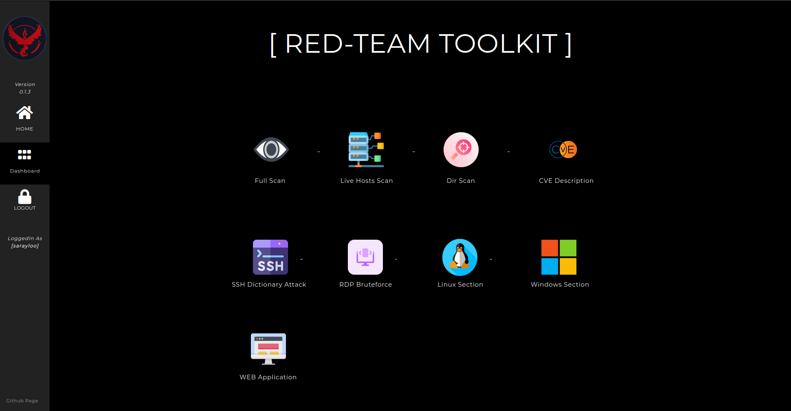

\

[](https://www.python.org/)
[](https://https://docker.com/)
[](https://svgshare.com/i/Zhy.svg)
[](https://github.com/signorrayan/RedTeam_toolkit/actions/workflows/lint_python.yml)
[](https://github.com/psf/black)


# RedTeam Toolkit
Note: Only legal activities should be conducted with this project.\
Red Team Toolkit is an Open-Source Django Offensive Web-App containing useful offensive tools used in the red-teaming together for the security specialist to identify vulnerabilities.

The cybersecurity open-source projects are integrated what will be a powerful toolkit together.

\
**Currently it supports the following options:**
- FullScan (scan ports and vulnerabilities/CVEs on the target - PDF output)
- Livehosts (scan all live hosts in the network scale - PDF output)
- DirScan (scan all directories on a target - PDF output)
- CVE Description ( CveID Search)
- SSH Dictionary Attack
- RDP BruteForce
- WebApps Section
  - F5 BIG-IP PoC ( CVE-2022-1388 )
  - Apache Path Traversal PoC ( CVE-2021-41773 )
  - Automated XSS Finder
  - Web Crawler for gathering URLs
  - SubDomain Enumeration
  - HTTP Verb Tampering
  - (SQLi will be added soon)
- Windows Section (Being updated, other major CVEs will be added)
  - Microsoft Exchange ProxyShell PoC ( CVE-2021-34523, CVE-2021-34473, CVE-2021-31207 )
- Linux Section to implement major Linux CVEs (UNDER MAINTENANCE)\
\



## :blue_book: Installation Guide
Dockerized version of the Web-App is available now:
```bash
git clone https://github.com/signorrayan/RedTeam_toolkit.git && cd RedTeam_toolkit
docker-compose up -d --build && docker-compose exec webapp python manage.py createsuperuser
# Create your local user and webapp will be available on --------> 127.0.0.1:4334
# Note: After restarting your machine, the web app will be automatically launched.
```
- If you prefer to build the project from scratch, you can find the installation guide in the [Installation wiki page](https://github.com/signorrayan/RedTeam_toolkit/wiki/Installation-Guide)
.
- Please refer to [Additional Information page](https://github.com/signorrayan/RedTeam_toolkit/wiki/Additional-Information) about toolkit modules.

## :computer: Demo
You can find the Demo gifs in the [Demo page](https://github.com/signorrayan/RedTeam_toolkit/wiki/Demo)


## :trident: Contributing
Thanks to all Open-Source projects that helped me in this project .

If 
- :exclamation: You see any issues 
- :dizzy: You can make the project works better
- :bulb: You have any suggestions/ideas such as adding other open-source tools
- :star2: You have created a script that can add an useful functionality to this project and solve a problem


Please consider contributing to this project .\
If you want to help us, don't be afraid to contribute! We have many things you can do to help out.\
To contributing you can create an issue or (better) you can **fork & create a pull request**.

if you do not know where to start, please contact me by email mo.sarayloo@protonmail.com

  
